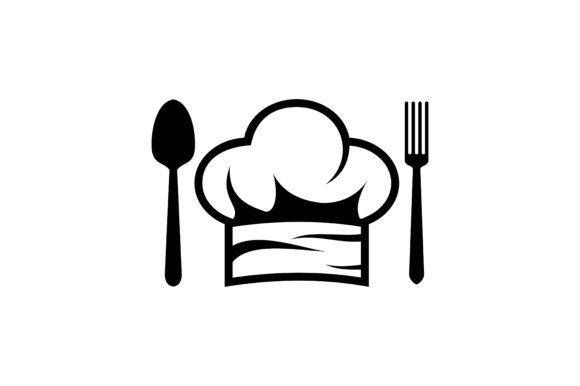

  

## Sebastian's Recipes

This web application is written using the framework Php Laravel. The main components used are Jetstream, Tailwind CSS, Livewire and Javascript. It was implemented using what is known as the Laravel TALL stack which stands for Tailwind, Alpine JS, Livewire and Laravel. The purpose of this web application is to allow registered users to create recipes and allow them to edit, delete and view the recipes they created. It also allows registered users and unregistered guests to view the recipes of all users. 

## Getting Started

Make sure you have composer downloaded and a database (e.g. TablePlus) for the migrations. 

* run `touch .env .` to create a .env file
* copy & paste the `.env example` into the freshly created .env file
* run `composer install; npm install; npm run dev`
* run `php artisan key:generate`
* run `php artisan migrate:fresh --seed`
* run `php artisan storage:link`
* run `php artisan serve`
  * or if you have valet services
  * run `valet park; valet link; valet secure; valet links`
  
## For More Beautiful Migration Images

Copy & Past the code below into this file `vendor/fakerphp/faker/src/Faker/Provider/Image.php`

    public static function imageUrl($width = 640, $height = 480, $category = null, $randomize = true, $word = null, $gray = false)
    {
        $baseUrl = "https://lorempixel.com/";
        $url = "{$width}/{$height}/";

        if ($gray) {
            $url = "gray/" . $url;
        }

        if ($category) {
            if (!in_array($category, static::$categories)) {
                throw new \InvalidArgumentException(sprintf('Unknown image category "%s"', $category));
            }
            $url .= "{$category}/";
            if ($word) {
                $url .= "{$word}/";
            }
        }

        if ($randomize) {
            $url .= '?' . static::randomNumber(5, true);
        }

        return $baseUrl . $url;
    }
